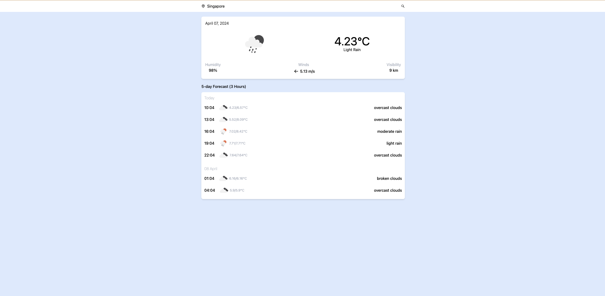
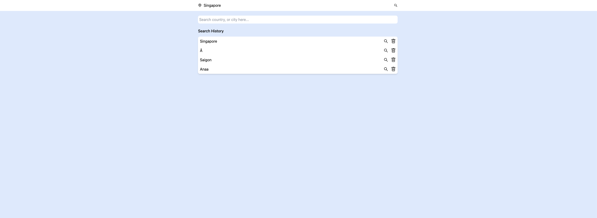
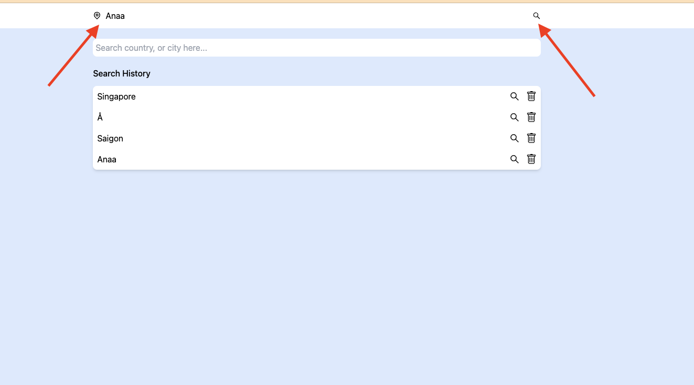

# Project Name

This project is a weather application built with React and TypeScript. It uses OpenWeatherMap API to fetch weather data.

### Project Structure
```sh
.
├── README.md
├── coverage
├── index.html
├── node_modules
├── package-lock.json
├── package.json
├── postcss.config.js
├── public
├── screenshots
├── src
├── tailwind.config.js
├── tsconfig.json
├── tsconfig.node.json
└── vite.config.ts

6 directories, 9 files

```

### Installation

1. Clone this project

2. Fill in env variables
```sh
cp .env.template .env
```

3. Install dependencies
```sh
npm install -f
```

4. Run the project and navigate to http://localhost:5173
```sh
npm run dev
```

### Run tests

```sh
npm run test
```

### Screen shots




### Navigation between pages

Clicking on `Location` icon should navigate to Home page

Clicking on `Search` icon should navigate to Search page.



### License

[MIT](https://choosealicense.com/licenses/mit/)